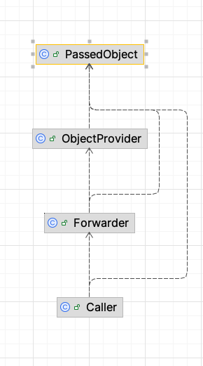

# Dependency Lab

Dependencies within an application, not across applications

# How Dependencies _Appear_

* imports
* calling a method of another class
* extending a class
* Using an enum
* Getting an object and just forward it
    * Except of renaming, changes in the class will never affect the forwarders

# Gained Insights

* IDEA diagrams do not visualize the decoupling gained by DI. The dependencies are still used, so the arrow stays.
* Getting data via callbacks with lambdas reduces the number of arrows, because the class executing the callback has no
  dependency on its caller. However, what stays is the dependency on the callers _object_ during runtime.
* IDEA diagrams do not visualize the _strength_ of the coupling between classes
    * The classes within `niklase.intensity` are coupled absurdly high but on the diagram it looks like are regular
      _uses_ relationship
* Compile-time dependencies and the modularization are often mixed up. Two modules can be coupled at compile-time but
  decoupled regarding to changes as long as the interface stays the same.
  The compile-time coupling can also be reduced by introducing some kind of indirection (e.g. a java _interface_), but
  there is no evidence that this improves the evolvability of the application.
  Maybe, the compile-time dependencies are so in focus, because they appear more obviously. The kind of dependency that
  slows down development speed are not the ones appearing at compile-time but the ones that cross abstraction layers. 
  Class A that knows too much about class B, just like the example implementation in `niklase.intensity`.

# Experiments

## callbackLambda

## callbackObject

## direct

## iface

## intensity

The class `ClassThatExposesTooManyDetails` is intentionally implemented in a way that leads to high coupling to that
class.
However, the class diagram does not reflect this high coupling. It only shows that one class uses another one.

Introducing a java interface between those classes would make the situation even worse, because in addition to the
high coupling, we have one additional file.

## variations on orchestration implementations

### o1

Dependencies from orchestrator to collaborators and between collaborators

### o2

Dependencies from orchestrator to collaborators and back

## Passing Through
A class whose task consists in just passing through an object. In general, this should be questioned but sometimes, this
is a valid design. E.g. when you have design constraints which prescribe to have one class on the business layer, although
the method just calls a DAO or repository and forwards the result to the initial caller.

However, the interesting thing is that on the class diagram, it looks like there are many dependencies on `PassedObject`.
According to common wisdom, this decreases the flexibility of `PassedObject`. But in reality neither `ObjectProvider`
nor `Forwarder` are making use of the interface of `PassedObject` (neither fields nor methods are used), so there is no reduction
of the flexibility of `PassedObject`, even though the class diagram shows dependencies.

In _The Many Facets of Coupling_, Gregor Hohpe uses the term _change propagation_ which I find useful. The term
focuses on _change_ while source code dependencies are sometimes, as shown in this example, mistakenly equated with decreased changeability.